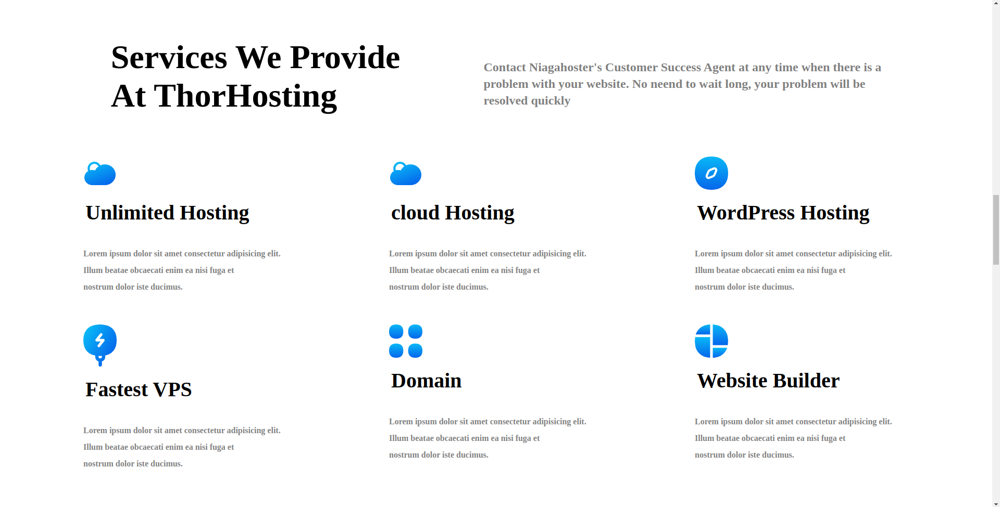

# Hosting | Page - HTML & CSS!

By Prince Kr Paswan

## [Link to the Hosting-Page (project-11)](https://seo-page.netlify.app/)

## What I learned While creating this page?

- Learnd to use css position  property.
- I learned how to add custom fonts.
- I learned about image positioning and image hight.

## This project took around 2 hours to complete.
